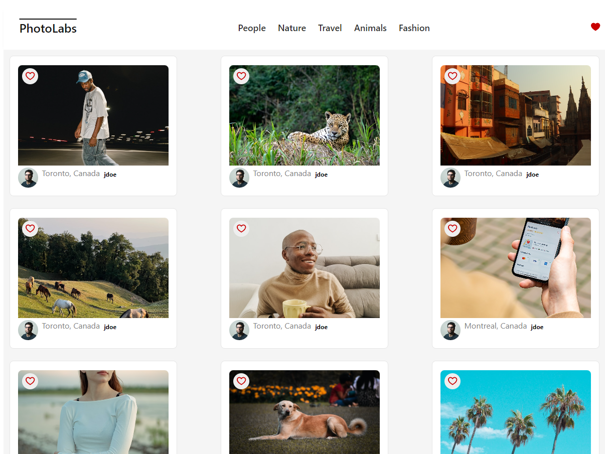
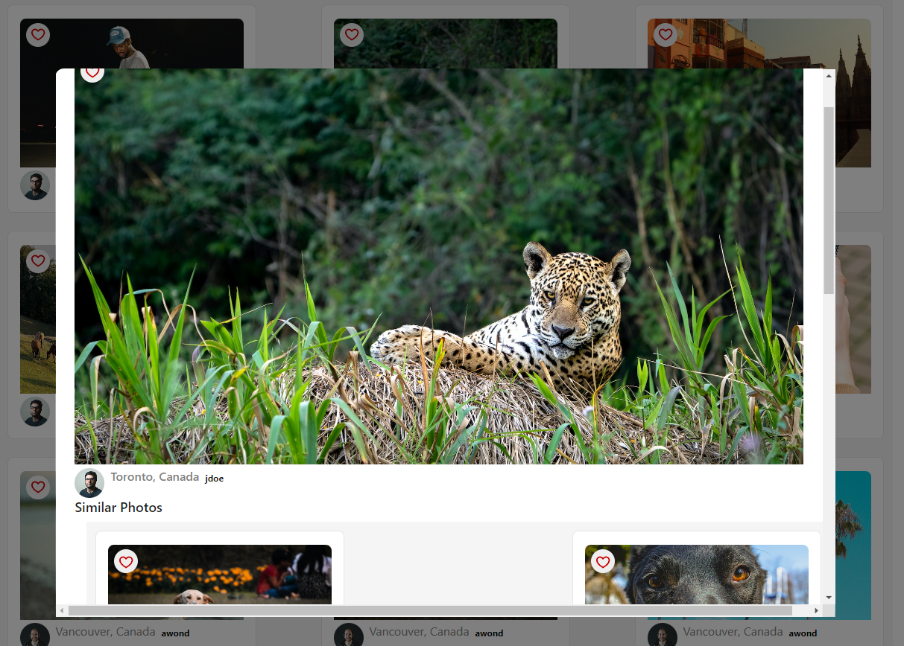

# react-photolabs
The PhotoLabs project for the Web Development React course programming.

# Photolabs

## Setup

Install dependencies with `npm install` in each respective `/frontend` and `/backend`.

## [Frontend] Running Webpack Development Server

```sh
cd frontend
npm start
```

## [Backend] Running Backend Servier

Read `backend/readme` for further setup details.

```sh
cd backend
npm start
```

## Files
### frontend
-public: Image resources.

-src

---assets: SVG files for symbols in the application.

---components: jsx files for components in the application.

---hooks: js files for processing hooks for data process.

---mocks: Local data storage.

---routes: route pages

---styles: scss files for project styling.

### pages


Main page for the application


Modal page for the application